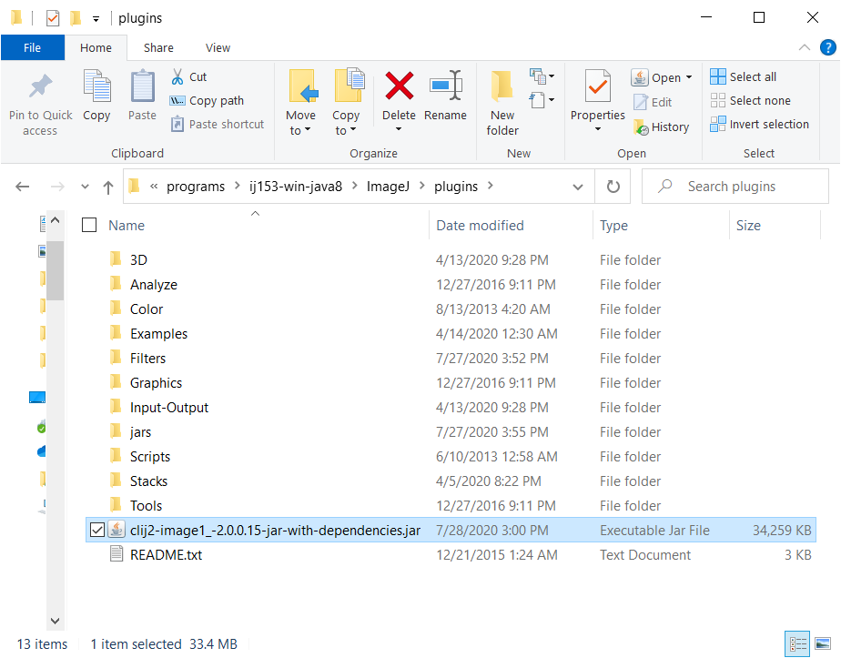
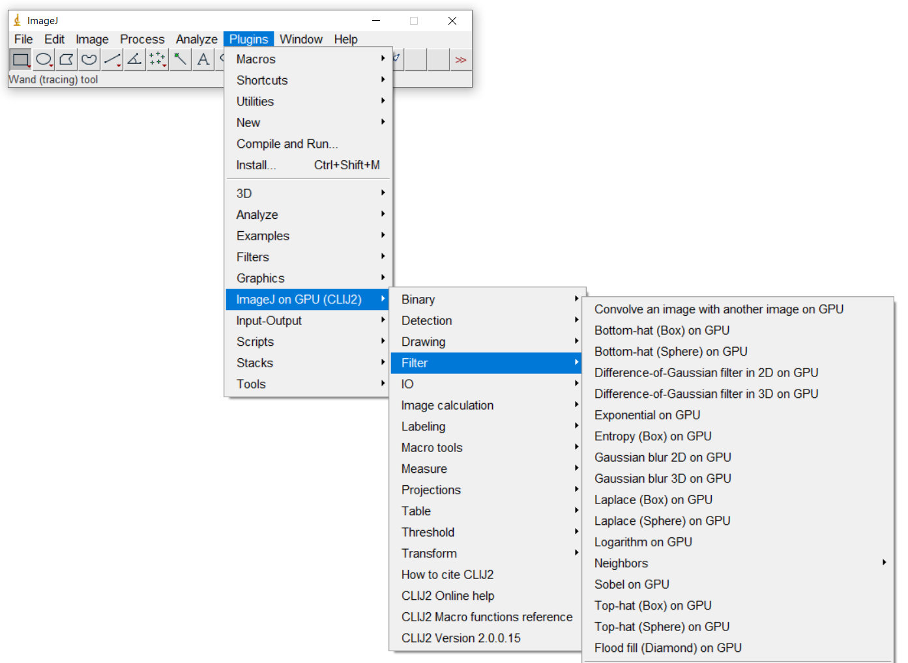

# CLIJ2 Installation in ImageJ

Download and upack [ImageJ](https://imagej.nih.gov/ij/download.html) and a jar-file called 
[clij2-imagej1](https://github.com/clij/clij2-imagej1/releases/download/2.1.4.7/clij2-imagej_-2.1.4.7-jar-with-dependencies.jar). 
Please put the jar file in the `plugins` sub-directory of ImageJ.

Restart ImageJ and enjoy:

Note: In order to make CLIJ2 macros run in ImageJ, please replace the "CLIJ2 Macro Extensions" in your macro by "CLIJ2 Legacy Macro Extensions".

[Back to CLIJ documentation](https://clij.github.io/)

[Imprint](https://clij.github.io/imprint)
